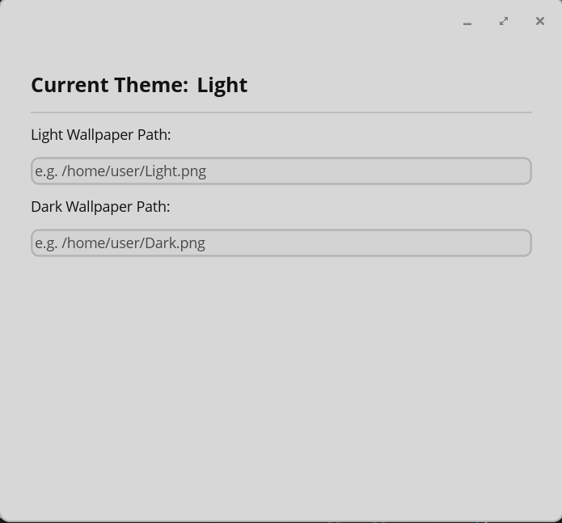

# COSMIC WallShift

A lightweight system-tray app for the [COSMIC Desktop Environment](https://github.com/pop-os/cosmic-epoch) that automatically switches your wallpaper when the system theme toggles between **Light** and **Dark** mode.

  



## Installation

### Flatpak (Recommended)
Once submitted to Flathub:
```bash
flatpak install flathub io.github.nagyrenato.CosmicWallShift
```

### Build from Source
**Prerequisites:** Rust toolchain (1.80+) and COSMIC DE build dependencies.

```bash
git clone https://github.com/nagyrenato/cosmic-wallshift
cd cosmic-wallshift
just build
sudo just install
```

## Usage

1. Launch the app to open the settings window.
2. Set the full paths to your **light** and **dark** wallpapers (supports `jpg`, `jpeg`, `png`, `webp`).
3. Close the window — the app moves to the system tray and monitors theme changes.

*Note: COSMIC applies a subtle tint to wallpapers by default.*

### Autostart on login
Create `~/.config/autostart/cosmic-wallshift.desktop`:
```ini
[Desktop Entry]
Type=Application
Name=COSMIC WallShift
Exec=/usr/local/bin/cosmic-wallshift
X-GNOME-Autostart-enabled=true
```

## Development & Contributing

- **VS Code:** Install **rust-analyzer** and **CodeLLDB** to use the provided launch configuration for debugging.
- **Checks:** Run `just check` before submitting pull requests.

**Test Flatpak build:**
```bash
flatpak-builder --install --user --force-clean build-dir io.github.nagyrenato.CosmicWallShift.yml
```
Regenerate Flatpak cargo sources after updating `Cargo.lock`:
```bash
python3 flatpak-cargo-generator.py Cargo.lock -o cargo-sources.json
```

## License
GPL-3.0-or-later — see [LICENSE](LICENSE).
